# 1C Portal - Application Functionality

A comprehensive multi-tenant content management system (CMS) built on Cloudflare's edge infrastructure, enabling organizations to create, manage, and publish content with sophisticated access controls and approval workflows.

---

## Table of Contents

1. [Application Overview](#application-overview)
2. [Technical Architecture](#technical-architecture)
3. [Authentication](#authentication)
4. [User Roles](#user-roles)
5. [Organization Management](#organization-management)
6. [Entity System](#entity-system)
7. [Field Types Reference](#field-types-reference)
8. [Data Visibility and Access Control](#data-visibility-and-access-control)
9. [R2 Storage Structure](#r2-storage-structure)
10. [Manifests and Bundles](#manifests-and-bundles)
11. [App Configuration](#app-configuration)
12. [XState Workflows](#xstate-workflows)
13. [User Flows](#user-flows)
14. [Non-Functional Requirements](#non-functional-requirements)

---

## Application Overview

### Purpose

The 1C Portal is a flexible CMS platform that enables:

- **Organizations** to create and manage content within defined entity types
- **Superadmins** to define the content model, manage organizations, and approve publications
- **Members** to browse published content with fast, offline-capable viewing

### Key Features

| Feature | Description |
|---------|-------------|
| Multi-Tenancy | Complete organization isolation with configurable permissions |
| Flexible Content Model | Custom entity types with configurable field types |
| Approval Workflow | Draft → Pending → Published lifecycle with superadmin approval |
| Offline Capability | Local data persistence for fast, offline-capable viewing |
| Modular Loading | Minimal initial bundle with role-based lazy loading |
| Alert System | Users can flag entities for update notifications |

### Value Proposition

- **Fast Performance**: Edge computing + local caching = sub-second page loads
- **Flexible Content**: Define any entity type with custom fields
- **Secure Multi-Tenancy**: Organizations can only access their own data
- **Offline-First**: Content available even without network connection

---

## Technical Architecture

### Technology Stack

| Layer | Technology | Purpose |
|-------|------------|---------|
| **Backend** | Cloudflare Workers | Stateless API endpoints, XState workflows |
| **Storage** | Cloudflare R2 | Versioned JSON files, manifests, bundles |
| **Real-time** | Durable Objects | Phase 2: Collaborative editing (optional) |
| **Frontend** | Preact + UnoCSS | Lightweight, fast UI with utility-first CSS |
| **Client Data** | TanStack DB | Local persistence and reactive queries |
| **Auth** | Magic Links + JWT | Passwordless authentication |
| **Workflows** | XState | State machines for entity/user/org flows |

### Architecture Diagram

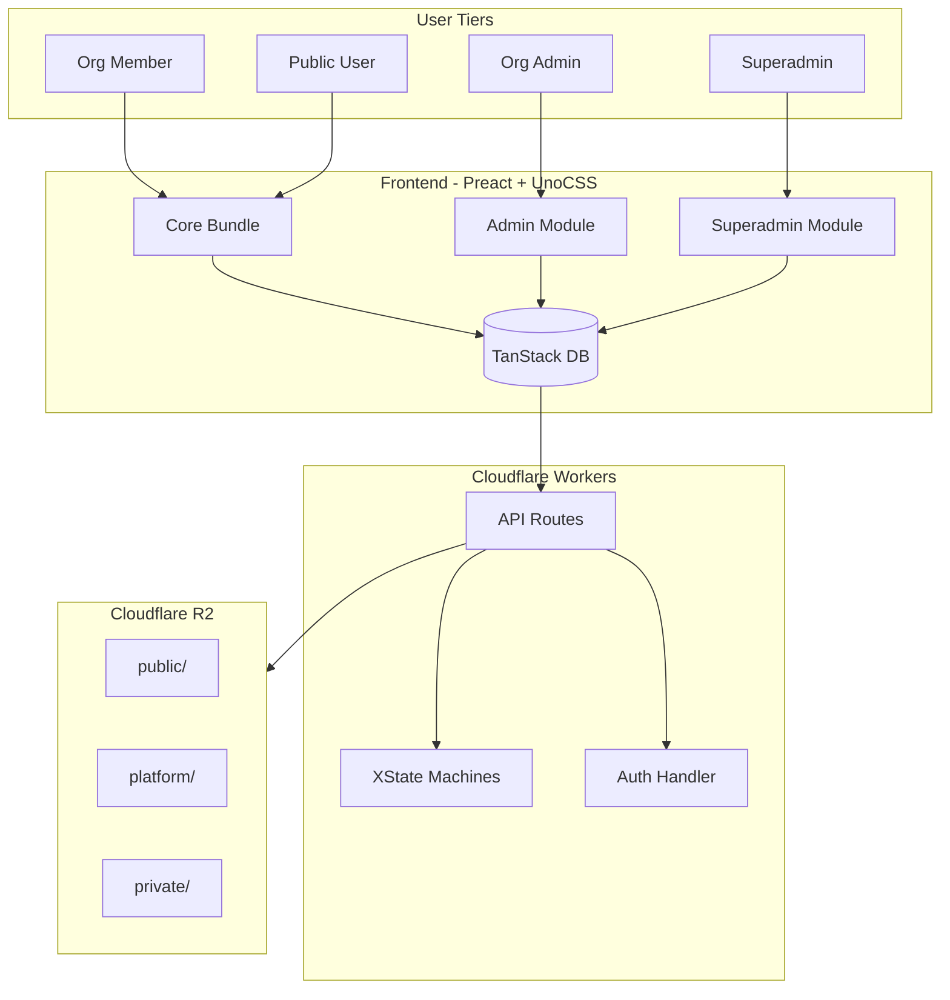

### Modular Frontend Loading

The frontend is split into modules that load based on user role:

| Bundle | Loaded When | Contains |
|--------|-------------|----------|
| **Core** | Always (initial load) | Auth, Browse, View, Alerts |
| **Org Admin** | On admin login | Entity Editor, User Management |
| **Superadmin** | On superadmin login | Type Manager, Org Manager, Approvals, Branding |

**Target**: Initial bundle < 50KB gzipped for fast first load.

---

## Authentication

### Magic Link Flow

Authentication uses passwordless magic links for security and simplicity:

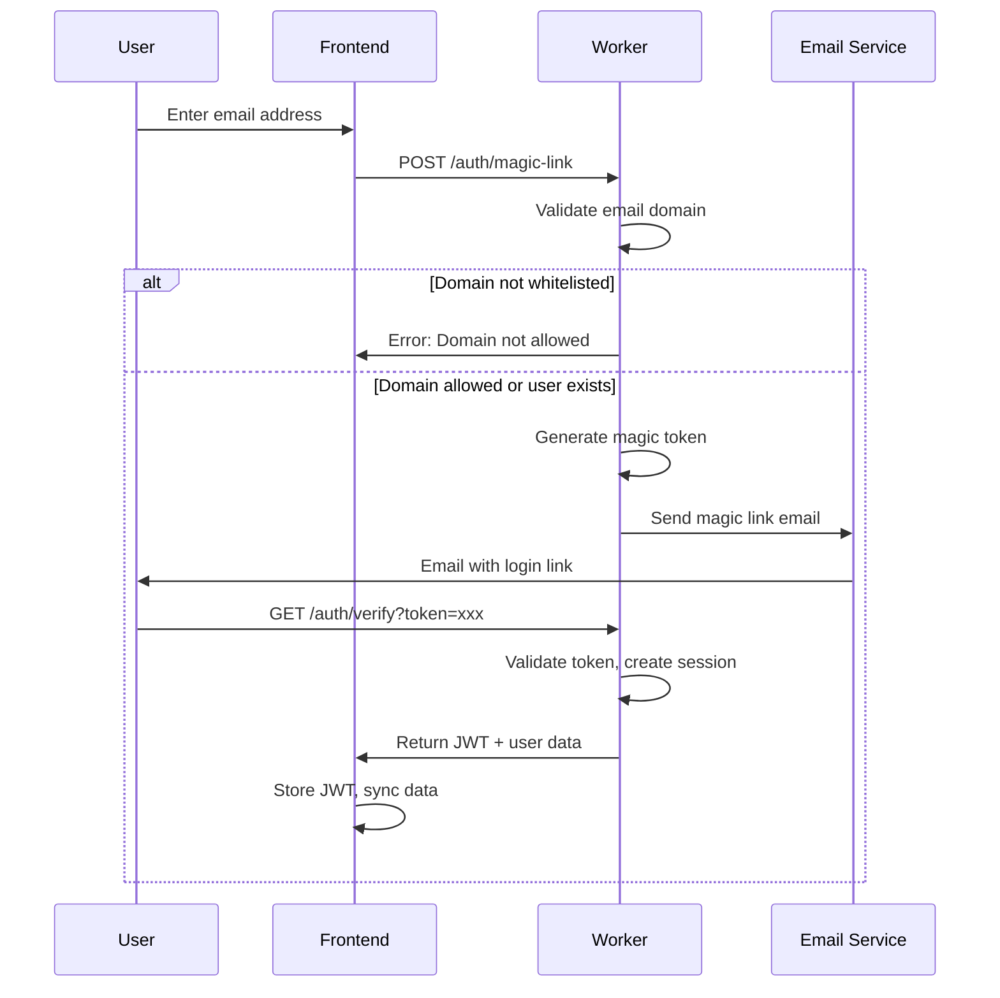

### Domain Whitelist

Organizations can configure allowed email domains for self-registration:

```json
{
  "domainWhitelist": ["company.com", "subsidiary.com"],
  "allowSelfSignup": true
}
```

- **Whitelisted domains**: Users can self-register and join the organization
- **Non-whitelisted domains**: Require explicit invitation from an org admin
- **No whitelist configured**: All domains allowed (or invitation-only if disabled)

### JWT Structure

```json
{
  "sub": "user-uuid",
  "email": "user@company.com",
  "role": "org_admin",
  "organizationId": "org-uuid",
  "iat": 1704844800,
  "exp": 1704931200
}
```

---

## User Roles

### Role Hierarchy

| Role | Scope | Description |
|------|-------|-------------|
| **Superadmin** | Platform-wide | Full system access, defines content model |
| **Org Admin** | Organization | Content management within their org |
| **Org Member** | Organization | View-only access to published content |

### Role Capabilities

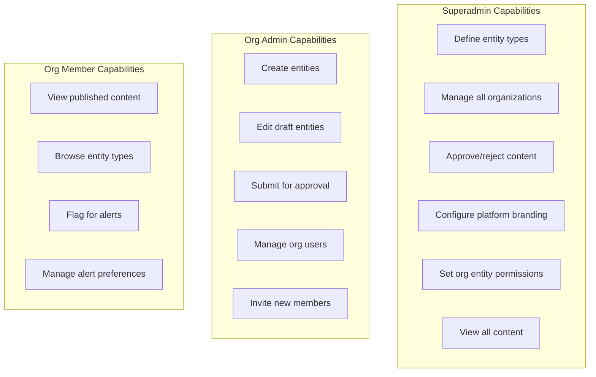

### Superadmin Responsibilities

- **Entity Type Management**: Create, edit, and configure entity type schemas
- **Organization Management**: Create organizations, set permissions, assign admins
- **Content Approval**: Review and approve/reject submitted content
- **Platform Configuration**: Branding, homepage settings, feature flags

### Org Admin Responsibilities

- **Content Creation**: Create entities of types allowed for their organization
- **Content Editing**: Edit draft entities and submit for approval
- **User Management**: Invite users, assign roles within organization
- **Organization Settings**: Update org profile, domain whitelist

### Org Member Capabilities

- **Content Browsing**: View published entities of allowed types
- **Alert Management**: Flag entities for update notifications
- **Offline Access**: Access cached content without network

---

## Organization Management

### Organization Structure

Each organization has:

```json
{
  "id": "org-uuid",
  "name": "Acme Corporation",
  "slug": "acme",
  "profile": {
    "description": "Leading technology company",
    "logoUrl": "https://cdn.example.com/logos/acme.png",
    "logoDarkUrl": "https://cdn.example.com/logos/acme-dark.png"
  },
  "settings": {
    "domainWhitelist": ["acme.com", "acme.co.uk"],
    "allowSelfSignup": true
  },
  "createdAt": "2026-01-01T00:00:00Z"
}
```

### Entity Type Permissions

Superadmins configure which entity types each organization can access:

```json
{
  "viewable": ["t4x8p2q", "r2y6k1m", "w5n9p3x"],
  "creatable": ["t4x8p2q", "r2y6k1m"]
}
```

| Permission | Description | Who Can Access |
|------------|-------------|----------------|
| **Viewable** | Entity types members can browse | All org members |
| **Creatable** | Entity types admins can add | Org admins only |

### Organization Membership

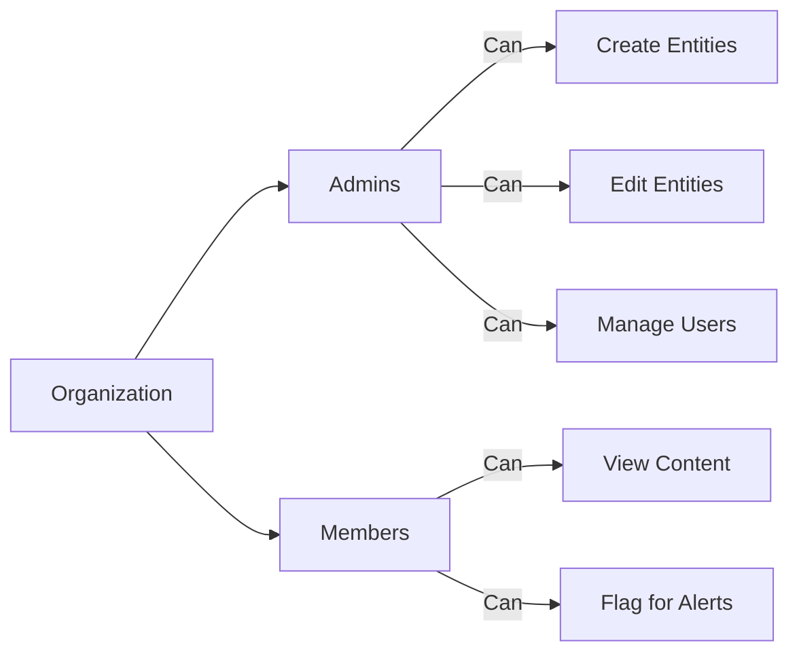

---

## Entity System

### Entity ID Generation

Entity IDs are short, unique identifiers generated server-side using a collision-resistant algorithm.

**Format:**
- **Characters**: Lowercase letters and numbers only (`a-z`, `0-9`)
- **Length**: 7 characters
- **Example**: `a7k2m9x`, `b3n8q2y`, `r0t6w4p`

**Generation:**
- Generated server-side using NanoID with custom alphabet
- Alphabet: `0123456789abcdefghijklmnopqrstuvwxyz` (36 characters)
- 7 characters = 36^7 ≈ 78 billion possible combinations
- Collision probability: < 1% after generating 1 million IDs

**Properties:**
- URL-safe (no encoding required)
- Case-insensitive storage and lookup
- Human-typeable and memorable
- Short enough to share verbally

**ID Stub:**
On creation, an ownership record is written to `stubs/{entityId}.json`:
```json
{
  "entityId": "a7k2m9x",
  "organizationId": "org-uuid",
  "entityTypeId": "type-uuid",
  "createdAt": "2026-01-10T12:00:00Z"
}
```

This enables fast entity → organization lookups without reading the full entity file.

### Entity Structure

Entities are the core content units, stored as versioned JSON:

```json
{
  "id": "a7k2m9x",
  "entityTypeId": "t4x8p2q",
  "organizationId": "org-uuid",
  "version": 3,
  "status": "published",
  "visibility": "public",
  "data": {
    "name": "Example Tool",
    "description": "A comprehensive software tool",
    "category": "Development",
    "website": "https://example.com",
    "pricing": "freemium"
  },
  "createdAt": "2026-01-01T12:00:00Z",
  "updatedAt": "2026-01-10T14:30:00Z",
  "createdBy": "user-123",
  "updatedBy": "user-456"
}
```

### Entity Lifecycle

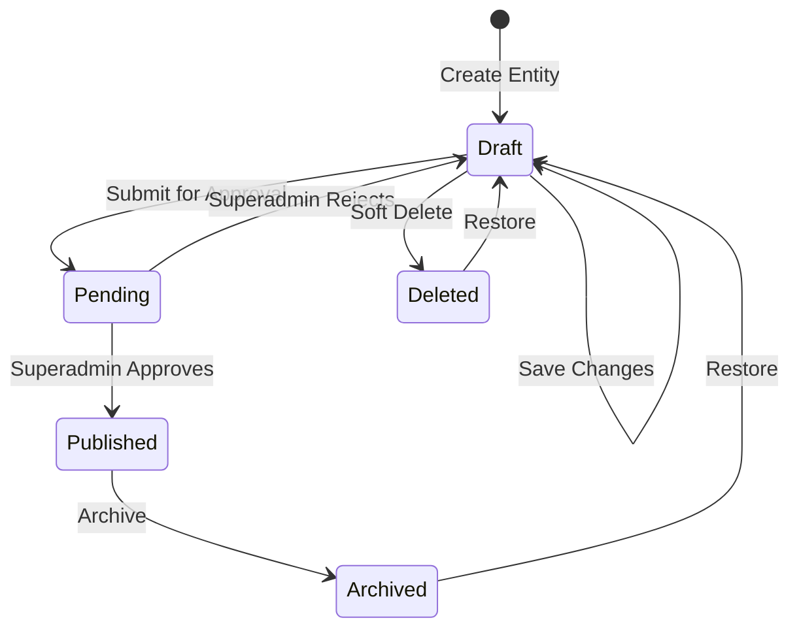

| Status | Description | Visible To |
|--------|-------------|------------|
| **Draft** | Work in progress | Org admins only |
| **Pending** | Awaiting approval | Org admins + Superadmins |
| **Published** | Live content | Based on visibility setting |
| **Archived** | No longer active | Superadmins only |
| **Deleted** | Soft-deleted | Superadmins only (restorable) |

### Explicit Save Model

Entity updates are **only sent to the server when the user explicitly clicks Save**:

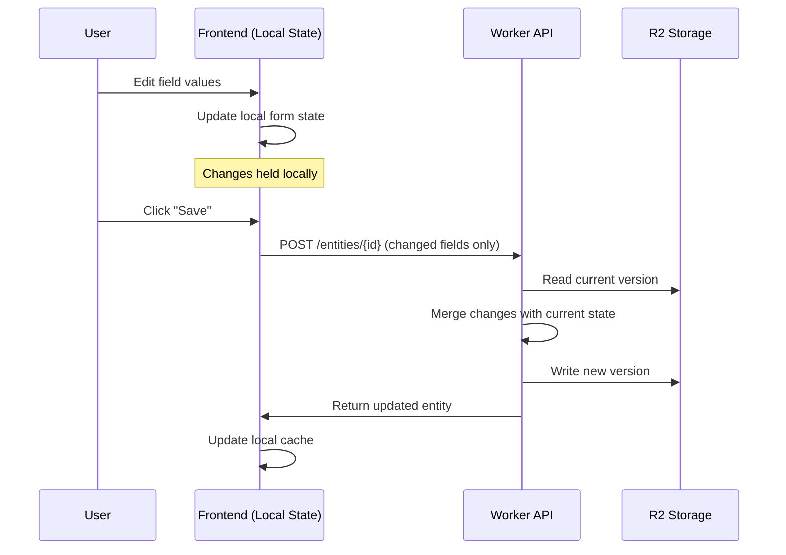

**Key behaviors:**
- No auto-save or debounced saves
- User has full control over when changes are persisted
- Unsaved changes warning if navigating away
- Draft indicator shows when local changes exist

### Atomic Field Updates

When the user saves, changes are **merged** with the previous state:

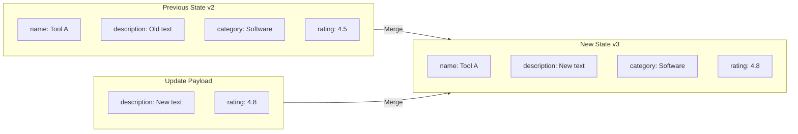

**Benefits of atomic updates:**

- Only modified fields sent in update payload (smaller requests)
- Concurrent edits to different fields don't conflict
- Field-level change tracking for audit logs
- Efficient storage (only changes recorded)

---

## Field Types Reference

### Available Field Types

| Type | Label | Description | Use Case |
|------|-------|-------------|----------|
| `string` | Short Text | Single line text input | Names, titles, short values |
| `text` | Long Text | Multi-line text input | Descriptions, notes |
| `markdown` | Markdown | Rich text with markdown support | Formatted content, documentation |
| `number` | Number | Numeric input | Counts, ratings, prices |
| `boolean` | Boolean | True/false checkbox | Flags, toggles |
| `date` | Date | Date picker | Event dates, deadlines |
| `select` | Select | Dropdown single selection | Categories, statuses |
| `multiselect` | Multi-Select | Dropdown multiple selection | Tags, features |
| `link` | Entity Reference | Reference to another entity | Relationships, associations |
| `image` | Image | Image upload/URL | Photos, screenshots |
| `logo` | Logo | Logo/icon upload | Branding images |
| `file` | File | File upload | Documents, attachments |
| `country` | Country | Country selector | Location data |

### Field Configuration

Each field supports constraints based on its type:

```json
{
  "id": "field_website",
  "name": "Website",
  "type": "string",
  "required": true,
  "description": "The official website URL",
  "constraints": {
    "min_length": 10,
    "max_length": 500
  },
  "display_order": 3,
  "section_id": "section_basic",
  "show_in_table": true
}
```

### Field Constraints by Type

| Type | Available Constraints |
|------|----------------------|
| `string`, `text`, `markdown` | `min_length`, `max_length` |
| `number` | `min_value`, `max_value` |
| `select`, `multiselect` | `options` (array of allowed values) |
| `link` | `link_entity_type_id`, `allow_multiple` |
| `image`, `logo`, `file` | `file_types` (allowed extensions) |
| `country` | `include_country_name`, `include_country_code`, `include_dial_code`, `include_flag` |

### Field Sections

Fields can be grouped into sections for organized form display:

```json
{
  "sections": [
    {
      "id": "section_basic",
      "name": "Basic Information",
      "description": "Core details about this entity",
      "display_order": 1
    },
    {
      "id": "section_details",
      "name": "Additional Details",
      "description": "Extended information",
      "display_order": 2
    }
  ]
}
```

---

## Data Visibility and Access Control

### Visibility Scopes

| Scope | Who Can See | Storage Location | SEO Indexable | Deep Linkable |
|-------|-------------|------------------|---------------|---------------|
| **Public** | Everyone (no auth required) | `public/entities/{id}/` | Yes | Yes |
| **Platform** | All authenticated users | `platform/entities/{id}/` | No | Yes |
| **Private** | Organization members only | `private/orgs/{orgId}/entities/{id}/` | No | Yes |

### Deep Linking and SEO

**Public Content:**
- Fully indexable by search engines (Google, Bing, etc.)
- Server-side rendered meta tags for social sharing (Open Graph, Twitter Cards)
- Canonical URLs: `https://example.com/browse/{typeSlug}/{entitySlug}`
- Sitemap generation for all public entities

**Platform and Private Content:**
- Deep linkable (direct URLs work for authenticated users)
- Protected from search engine indexing via:
  - `robots.txt` exclusion rules
  - `<meta name="robots" content="noindex, nofollow">` tags
  - Authentication required before content loads
- Share links work but require login to view

### Entity Type Level Controls

Superadmins configure visibility rules at the entity type level:

```json
{
  "id": "t4x8p2q",
  "name": "Tools",
  "allowPublic": true,
  "defaultVisibility": "platform"
}
```

| Setting | Description |
|---------|-------------|
| `allowPublic` | Whether entities of this type can be published publicly |
| `defaultVisibility` | Default visibility when creating new entities |

### Access Control Flow

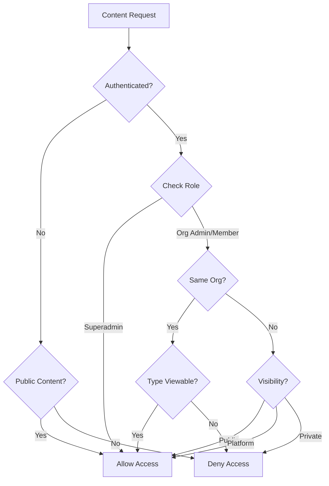

### URL Structure for Deep Linking

All content is accessible via clean, human-readable URLs:

| Content Type | URL Pattern | Example |
|--------------|-------------|---------|
| Public entity list | `/browse/{typeSlug}` | `/browse/tools` |
| Public entity detail | `/browse/{typeSlug}/{entitySlug}` | `/browse/tools/acme-toolkit` |
| Platform entity list | `/platform/{typeSlug}` | `/platform/services` |
| Platform entity detail | `/platform/{typeSlug}/{entitySlug}` | `/platform/services/consulting` |
| Private entity list | `/org/{orgSlug}/{typeSlug}` | `/org/acme/projects` |
| Private entity detail | `/org/{orgSlug}/{typeSlug}/{entitySlug}` | `/org/acme/projects/q1-launch` |

**Slug Generation:**
- Entity slugs auto-generated from name field (e.g., "Acme Toolkit" → `acme-toolkit`)
- Uniqueness enforced per entity type
- Manual override available for custom slugs

---

## R2 Storage Structure

### Directory Layout

```
config/
  app.json                              # Application configuration

public/
  manifests/
    site.json                           # Public entity type list
  bundles/
    {typeId}.json                       # All public entities of type
  entities/{entityId}/
    v1.json                             # Version 1 snapshot
    v2.json                             # Version 2 snapshot
    latest.json                         # Current version pointer
  entity-types/{typeId}/
    definition.json                     # Type schema and field definitions

platform/
  manifests/
    site.json                           # Platform entity type list
  bundles/
    {typeId}.json                       # Platform entities by type
  entities/{entityId}/
    v{n}.json                           # Version snapshots
    latest.json                         # Current version pointer

private/
  orgs/{orgId}/
    profile.json                        # Organization settings
    manifests/
      site.json                         # Org-specific type list
    bundles/
      {typeId}.json                     # Org entities by type
    entities/{entityId}/
      v{n}.json                         # Version snapshots
      latest.json                       # Current version pointer
    users/
      {userId}.json                     # User membership record
  policies/organizations/{orgId}/
    entity-type-permissions.json        # Viewable + creatable types
  users/{userId}/
    flags/{entityId}.json               # Alert subscriptions
    preferences.json                    # Alert settings

stubs/
  {entityId}.json                       # Entity ID → Org ID mapping

secret/
  ROOT.json                             # Root organization ID
```

### File Contents Reference

#### Entity Version File (`entities/{id}/v{n}.json`)

```json
{
  "id": "a7k2m9x",
  "entityTypeId": "t4x8p2q",
  "organizationId": "org-uuid",
  "version": 2,
  "status": "published",
  "visibility": "public",
  "data": {
    "name": "Example Entity",
    "description": "Detailed description here",
    "category": "Software",
    "website": "https://example.com"
  },
  "createdAt": "2026-01-01T12:00:00Z",
  "updatedAt": "2026-01-10T14:30:00Z",
  "createdBy": "user-123",
  "updatedBy": "user-456"
}
```

#### Latest Pointer File (`entities/{id}/latest.json`)

```json
{
  "version": 2,
  "status": "published",
  "visibility": "public",
  "updatedAt": "2026-01-10T14:30:00Z"
}
```

#### Entity Type Definition (`entity-types/{id}/definition.json`)

```json
{
  "id": "t4x8p2q",
  "name": "Tool",
  "pluralName": "Tools",
  "description": "Software tools and applications",
  "allowPublic": true,
  "defaultVisibility": "platform",
  "fields": [
    {
      "id": "name",
      "name": "Name",
      "type": "string",
      "required": true,
      "display_order": 1
    },
    {
      "id": "description",
      "name": "Description",
      "type": "markdown",
      "required": false,
      "display_order": 2
    }
  ],
  "sections": [
    {
      "id": "basic",
      "name": "Basic Information",
      "display_order": 1
    }
  ],
  "tableDisplayConfig": {
    "showName": true,
    "showStatus": true,
    "showUpdated": true
  }
}
```

#### Organization Profile (`private/orgs/{orgId}/profile.json`)

```json
{
  "id": "k9m3n7w",
  "name": "Acme Corporation",
  "slug": "acme",
  "description": "Leading technology company",
  "logoUrl": "https://cdn.example.com/acme-logo.png",
  "logoDarkUrl": "https://cdn.example.com/acme-logo-dark.png",
  "domainWhitelist": ["acme.com", "acme.co.uk"],
  "allowSelfSignup": true,
  "createdAt": "2026-01-01T00:00:00Z",
  "updatedAt": "2026-01-05T10:00:00Z"
}
```

#### Entity Type Permissions (`policies/organizations/{orgId}/entity-type-permissions.json`)

```json
{
  "organizationId": "k9m3n7w",
  "viewable": ["t4x8p2q", "r2y6k1m", "w5n9p3x"],
  "creatable": ["t4x8p2q", "r2y6k1m"],
  "updatedAt": "2026-01-05T10:00:00Z",
  "updatedBy": "superadmin-user-id"
}
```

#### User Membership (`private/orgs/{orgId}/users/{userId}.json`)

```json
{
  "userId": "u8k4m2x",
  "organizationId": "k9m3n7w",
  "role": "org_admin",
  "email": "admin@acme.com",
  "joinedAt": "2026-01-02T09:00:00Z",
  "invitedBy": "u3p7n1y"
}
```

#### ID Stub (`stubs/{entityId}.json`)

```json
{
  "entityId": "a7k2m9x",
  "organizationId": "k9m3n7w",
  "entityTypeId": "t4x8p2q",
  "createdAt": "2026-01-01T12:00:00Z"
}
```

---

## Manifests and Bundles

### Purpose

- **Manifests**: Index files listing available entity types and their metadata
- **Bundles**: Pre-aggregated entity data for efficient client sync

### Manifest Types

| Manifest | Purpose | Location |
|----------|---------|----------|
| **Public Site Manifest** | Entity types available to everyone | `public/manifests/site.json` |
| **Platform Manifest** | Entity types for authenticated users | `platform/manifests/site.json` |
| **Organization Manifest** | Entity types for org members | `private/orgs/{orgId}/manifests/site.json` |

### Manifest Structure

```json
{
  "generatedAt": "2026-01-10T12:00:00Z",
  "version": 42,
  "entityTypes": [
    {
      "id": "t4x8p2q",
      "name": "Tools",
      "pluralName": "Tools",
      "description": "Software tools catalog",
      "entityCount": 156,
      "bundleVersion": 38,
      "lastUpdated": "2026-01-10T11:00:00Z"
    },
    {
      "id": "r2y6k1m",
      "name": "Services",
      "pluralName": "Services",
      "description": "Business services directory",
      "entityCount": 89,
      "bundleVersion": 25,
      "lastUpdated": "2026-01-09T15:00:00Z"
    }
  ]
}
```

### Bundle Types

| Bundle | Content | Location |
|--------|---------|----------|
| **Public Type Bundle** | All public entities of a type | `public/bundles/{typeId}.json` |
| **Platform Type Bundle** | Platform-visible entities | `platform/bundles/{typeId}.json` |
| **Organization Type Bundle** | Org-private entities | `private/orgs/{orgId}/bundles/{typeId}.json` |

### Bundle Structure

```json
{
  "typeId": "t4x8p2q",
  "typeName": "Tools",
  "generatedAt": "2026-01-10T12:00:00Z",
  "version": 38,
  "entityCount": 156,
  "entities": [
    {
      "id": "a7k2m9x",
      "version": 3,
      "status": "published",
      "data": {
        "name": "Tool A",
        "description": "A powerful development tool",
        "category": "Development"
      },
      "updatedAt": "2026-01-10T11:00:00Z"
    },
    {
      "id": "b3n8q2y",
      "version": 1,
      "status": "published",
      "data": {
        "name": "Tool B",
        "description": "Analytics and monitoring",
        "category": "Analytics"
      },
      "updatedAt": "2026-01-09T15:00:00Z"
    }
  ]
}
```

### Client Sync Flow

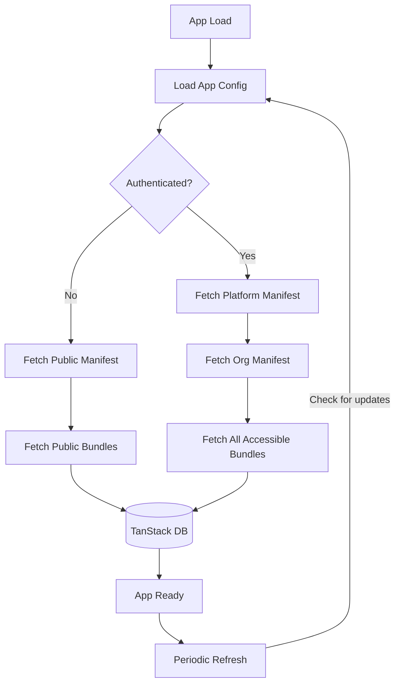

### Bundle Versioning

- Each bundle has a version number that increments on any entity change
- Clients store the last-synced version
- On refresh, clients can skip bundles that haven't changed
- Reduces bandwidth and improves sync performance

---

## App Configuration

### App Config File

Loaded on application startup from `config/app.json`:

```json
{
  "version": "1.0.0",
  "environment": "production",
  "apiBaseUrl": "https://api.1c-portal.com",
  "r2PublicUrl": "https://cdn.1c-portal.com",
  "features": {
    "alerts": true,
    "offlineMode": true,
    "realtime": false,
    "darkMode": true
  },
  "branding": {
    "rootOrgId": "ORG_ROOT",
    "siteName": "1C Portal",
    "defaultTheme": "light",
    "logoUrl": "/logo.svg"
  },
  "sync": {
    "bundleRefreshInterval": 300000,
    "staleTime": 60000,
    "gcTime": 86400000
  },
  "auth": {
    "magicLinkExpiry": 600,
    "sessionDuration": 604800
  }
}
```

### Configuration Options

| Section | Option | Description |
|---------|--------|-------------|
| **features** | `alerts` | Enable entity alert/flag system |
| **features** | `offlineMode` | Enable local persistence |
| **features** | `realtime` | Enable collaborative editing (Phase 2) |
| **sync** | `bundleRefreshInterval` | How often to check for updates (ms) |
| **sync** | `staleTime` | Time before data considered stale (ms) |
| **auth** | `magicLinkExpiry` | Magic link validity (seconds) |
| **auth** | `sessionDuration` | JWT validity (seconds) |

---

## XState Workflows

State machines manage complex flows in Cloudflare Workers.

### Entity Lifecycle Machine

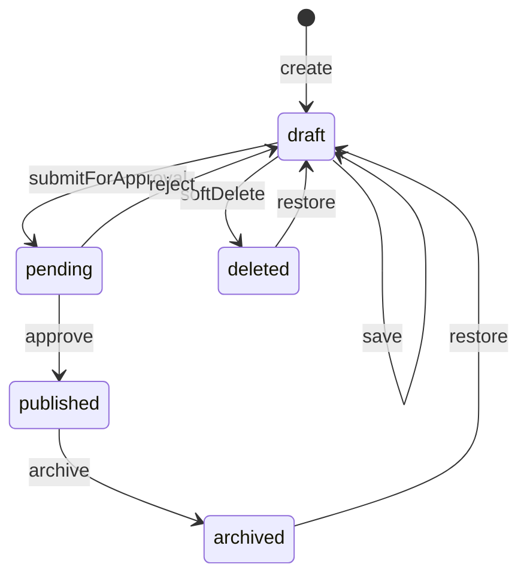

**Events:**
- `create`: Initialize new entity in draft state
- `save`: User explicitly saves changes (atomic field merge)
- `submitForApproval`: Move to pending review
- `approve`: Superadmin publishes entity
- `reject`: Superadmin returns to draft with feedback
- `archive`: Remove from active listings
- `restore`: Return archived/deleted to draft
- `softDelete`: Mark as deleted (recoverable)

**Note:** The `save` event only fires when the user explicitly clicks the Save button. There is no auto-save functionality.

### User Setup Flow Machine

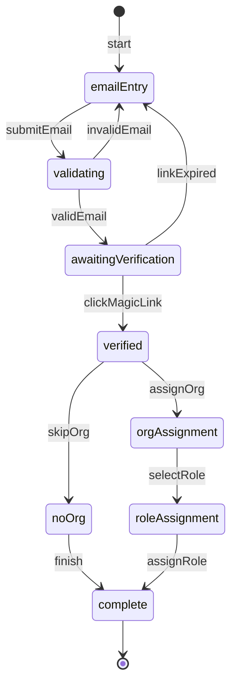

### Organization Creation Machine

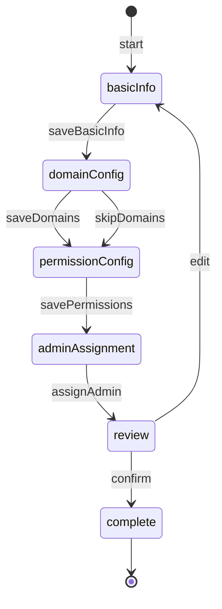

---

## User Flows

### Superadmin Flows

#### Create Entity Type

1. Navigate to Superadmin → Entity Types
2. Click "Create New Type"
3. Enter type name, plural name, description
4. Configure `allowPublic` and `defaultVisibility`
5. Add fields with types and constraints
6. Organize fields into sections
7. Save entity type definition

#### Manage Organization Permissions

1. Navigate to Superadmin → Organizations
2. Select organization to edit
3. Go to "Entity Type Permissions"
4. Select which types are viewable by members
5. Select which types are creatable by admins
6. Save permissions

#### Approve Content

1. Navigate to Superadmin → Approvals Queue
2. Review pending entities
3. Click entity to preview
4. Choose "Approve" (publishes) or "Reject" (returns to draft)
5. Optionally add feedback comment

### Org Admin Flows

#### Create Entity

1. Navigate to organization dashboard
2. Select entity type to create
3. Fill in required and optional fields (changes held locally)
4. Click "Save" to persist as draft (explicit save required)
5. Continue editing or submit for approval

**Note:** Changes are only sent to the server when clicking Save. Navigating away with unsaved changes shows a warning.

#### Submit for Approval

1. Open draft entity
2. Review all fields are complete
3. Click "Submit for Approval"
4. Entity moves to pending status
5. Wait for superadmin review

#### Invite User

1. Navigate to Organization → Users
2. Click "Invite User"
3. Enter email address
4. Select role (Admin or Member)
5. Send invitation
6. User receives magic link email

### Org Member Flows

#### Browse Content

1. Log in with magic link
2. View available entity types on homepage
3. Click entity type to see list
4. Click entity to view details
5. Content loads from local cache (fast)

#### Flag for Alerts

1. View entity detail page
2. Click "Flag for Alerts"
3. Select alert frequency (daily/weekly/monthly)
4. Receive notifications when entity updates

#### Manage Alerts

1. Navigate to Alerts page
2. View all flagged entities
3. Adjust frequency or remove flags
4. Configure global alert preferences

---

## Non-Functional Requirements

### Security

| Requirement | Implementation |
|-------------|----------------|
| **Authentication** | Passwordless magic links (no password storage) |
| **Authorization** | Role-based access control (RBAC) |
| **Data Isolation** | R2 path-based separation by organization |
| **Domain Whitelist** | Self-signup restricted to approved domains |
| **Token Security** | Short-lived JWTs with secure signing |
| **Input Validation** | All inputs validated before storage |
| **XSS Protection** | Content sanitized on render |

### Performance

| Requirement | Target | Implementation |
|-------------|--------|----------------|
| **Initial Load** | < 2 seconds | Minimal core bundle (~50KB gzipped) |
| **Subsequent Pages** | < 500ms | TanStack DB local cache |
| **API Response** | < 200ms | Edge computing (Cloudflare Workers) |
| **Bundle Sync** | < 5 seconds | Incremental bundle updates |
| **Offline Access** | Instant | Local persistence in TanStack DB |

**Performance Strategies:**

- **Edge Computing**: Workers run at 300+ global locations
- **Bundle-based Sync**: Fetch entity bundles, not individual records
- **Local Caching**: TanStack DB stores data locally
- **Lazy Loading**: Admin modules loaded only when needed
- **Optimistic Updates**: UI updates before server confirmation

### Reliability

| Requirement | Implementation |
|-------------|----------------|
| **Offline Support** | Local persistence survives network loss |
| **Data Versioning** | Every entity change creates new version |
| **Rollback** | Previous versions restorable |
| **Atomic Updates** | Field-level merges prevent data loss |
| **Error Recovery** | Graceful degradation on failures |
| **Audit Trail** | All changes tracked with user/timestamp |

### Scalability

| Component | Scaling Approach |
|-----------|------------------|
| **API** | Cloudflare Workers auto-scale |
| **Storage** | R2 unlimited capacity |
| **Bundles** | Per-type bundles limit payload size |
| **Client** | TanStack DB handles large datasets |

---

## Glossary

| Term | Definition |
|------|------------|
| **Entity** | A content item of a specific type |
| **Entity Type** | Schema defining structure of entities |
| **Organization** | A tenant with its own users and content |
| **Bundle** | Pre-aggregated entity data for sync |
| **Manifest** | Index of available entity types |
| **Visibility** | Access scope (public/platform/private) |
| **Magic Link** | Passwordless authentication link |
| **TanStack DB** | Client-side data storage |
| **XState** | State machine library for workflows |

---

## Document History

| Version | Date | Changes |
|---------|------|---------|
| 1.0.0 | 2026-01-10 | Initial documentation |
